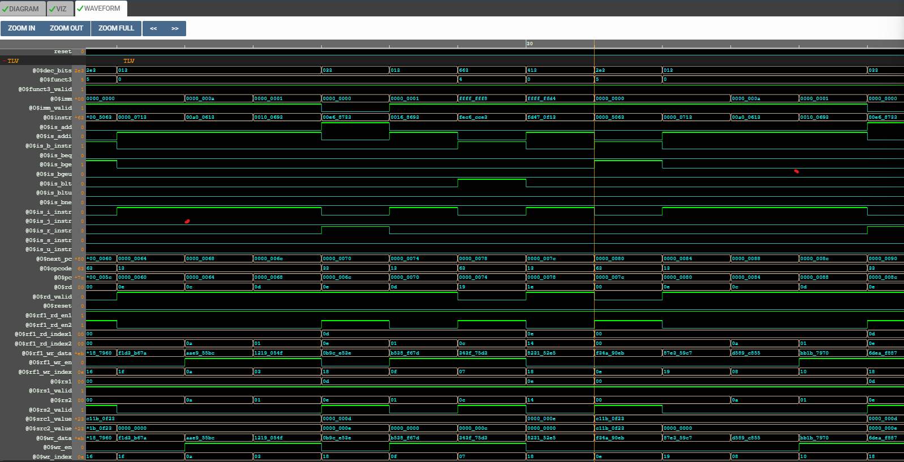
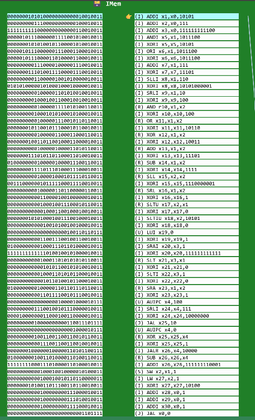

# 32-Bit RISC-V CPU Core Development 🚀

This repository documents the architectural design, implementation, and verification of a 32-bit RISC-V processor core. The project is developed using **TL-Verilog** on the Makerchip platform.

The development is divided into two major phases:
1.  **Phase 1 (Completed):** Construction of the 5-stage pipeline and verification with a custom summation algorithm.
2.  **Phase 2 (In Progress):** Expansion to full ISA compliance using the RISC-V standard test suite.

---

## ✅ Phase 1: Core Architecture Construction (Detailed Breakdown)

In this phase, we built the processor from scratch, implementing the datapath stage by stage. Each logic block was verified using waveforms before moving to the next.

### Step 1: Instruction Fetch & PC Logic
The first step was establishing the heartbeat of the processor. We implemented a Program Counter (PC) that increments by 4 bytes each cycle to fetch 32-bit instructions from the Instruction Memory (IMem).
* **Logic:** `PC = Next_PC` (Reset to 0, otherwise increment).
* **Verification:** The waveform shows instructions (`$instr`) changing dynamically as the `$pc` address updates.

*Evidence: Instruction Fetching based on PC address.*

### Step 2: Instruction Decode
Once fetched, the processor must understand the instruction. We implemented a decoder to parse the 32-bit machine code.
* **Logic:** Extracted Opcode, Function Fields (`funct3`, `funct7`), Register Indices (`rs1`, `rs2`, `rd`), and Immediate values (`imm`).
* **Verification:** The waveform confirms that signals like `$rs1_valid` and `$imm_valid` toggle correctly based on the Instruction Type (I-Type, R-Type, etc.).

*Evidence: Field extraction and Type decoding.*

### Step 3: Register File Read
The core needs data to process. We connected the decoded Source Register indices (`rs1`, `rs2`) to the Register File's read ports.
* **Logic:** Asynchronous reading of values from the 32x32-bit Register File.
* **Verification:** Verified that `$src1_value` and `$src2_value` carry the correct data stored in the requested registers.

*Evidence: Reading data from source registers.*

### Step 4: ALU Operations (Execute)
The Arithmetic Logic Unit (ALU) is the computation engine. We implemented support for `ADD` and `ADDI` instructions.
* **Logic:** `$result = $src1_value + ($is_addi ? $imm : $src2_value)`.
* **Verification:** In the test case below, the ALU correctly adds inputs `13` and `14` to produce `27`.

*Evidence: Correct arithmetic calculation.*

### Step 5: Register File Write-Back
Computations are useless if not saved. We implemented the Write-Back stage to store ALU results back into the Destination Register (`rd`).
* **Logic:** Synchronous write operation enabled only for valid destination registers (`$rd_valid`).
* **Verification:** The waveform proves that the value `1` is successfully written into register `x13` (0d), enabling sequential processing.

*Evidence: Data being permanently stored in the Register File.*

### Step 6: Branch Logic & Control Flow
Finally, we made the processor "intelligent" by adding decision-making capabilities.
* **Logic:** The Branch Unit calculates the Target Address (`PC + Imm`) and asserts `$taken_br` if the condition (e.g., `BLT`, `BEQ`) is met.
* **Verification:** The "Sum 1 to 9" program relied on a loop. The visualization below confirms the processor successfully executed the loop and passed the verification check.

*Evidence: The Core displaying "Passed !!!" after successfully executing the summation loop.*

---

## 🔄 Phase 2: Full ISA Compliance (Current Status)

Having verified the core architecture, we have now transitioned to **Phase 2**. We replaced the simple loop program with **`m4_test_prog()`**, a comprehensive RISC-V diagnostic suite.

* **Objective:** The test program executes every instruction in the RV32I Base Integer Set.
* **Success Metric:** Each valid instruction writes the value `1` to a specific register (`x5` through `x30`).
* **Current State:** The core supports basic arithmetic and branching. We are now working on implementing:
    * Logical Operations (AND, OR, XOR)
    * Shift Operations (SLL, SRL, SRA)
    * Comparison Operations (SLT, SLTU)
    * Load/Store Memory Access

*Above: The new test environment loaded into IMem.*

---

## 📂 Project Structure

* **`riscv_core.tlv`**: The main processor source code (Currently in Phase 2 configuration).
* **`lib/`**: External RISC-V macro definitions.
* **`assets/`**: Verification proofs and waveforms from Phase 1.

---

## 🚀 Development Tools

* **Language:** [TL-Verilog](https://www.redwoodeda.com/tl-verilog)
* **IDE:** [Makerchip](https://makerchip.com/)
* **Architecture:** [RISC-V RV32I](https://riscv.org/)