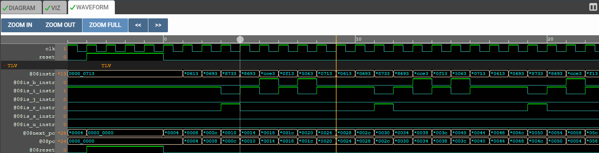

# 32-Bit RISC-V CPU Core Development 🚀

This repository documents the step-by-step construction of a 32-bit RISC-V processor core. The project is designed using **TL-Verilog** on the Makerchip platform and aims to build a fully functional processor compliant with the **RV32I Base Integer Instruction Set**.

The development process follows a "build-from-scratch" approach, starting from an empty shell and progressively adding logic stages such as Instruction Fetch, Decode, ALU, and Pipelining.

---

## 🛠️ Current Status: Stage 3 (Decode & Field Extraction)

We have successfully implemented the complete Decode Logic. The processor can now identify instruction types and extract all necessary fields (Source/Destination Registers, Immediates, Opcode).

| Stage | Status | Description |
| :--- | :---: | :--- |
| **1. Project Shell & PC Logic** | ✅ | **Project structure setup and basic Program Counter implementation.** |
| **2. Instruction Fetch** | ✅ | **Connecting PC to IMem and fetching instructions.** |
| **3. Decode Logic** | ✅ | **Instruction Type Parsing & Field Extraction (rs1, rs2, rd, imm).** |
| **4. ALU Operations** | ⏳ | Arithmetic and Logic computations. |
| **5. Branching & Control** | ⏳ | Control flow logic and decision making. |
| **6. Pipelining** | ⏳ | Parallel execution stages for performance. |

---

## 🧩 Implemented Logic Description

### 1. Project Shell & PC
The foundation of the processor. The **Program Counter (PC)** serves as the address pointer, resetting to `0` and incrementing by `4` bytes each cycle to traverse the instruction memory.

### 2. Instruction Memory (IMem)
The Instruction Memory acts as the bridge between the "address" (PC) and the "operation" (Instruction). It fetches the 32-bit machine code corresponding to the current PC address.

### 3. Decode Logic & Field Extraction
This stage transforms the raw 32-bit instruction into meaningful control signals and data indices:
* **Type Parsing:** Determines if the instruction is R-Type, I-Type, S-Type, B-Type, U-Type, or J-Type.
* **Field Extraction:** Slices specific bits from the instruction to identify:
    * **Opcode:** The primary operation identifier.
    * **rd (Destination Register):** Where the result will be saved.
    * **rs1 / rs2 (Source Registers):** Which registers hold the input data.
    * **funct3 / funct7:** Secondary operation identifiers.
    * **Immediate (imm):** Constant values embedded directly in the instruction (constructed differently based on instruction type).

---

## 📸 Simulation & Verification

The functionality of the core is verified using waveform simulations. Below are the results for the completed stages.

### Stage 1: Program Counter Verification
The waveform below demonstrates the Program Counter logic.
* **Observation:** The Next-PC signal (`$next_pc`) and current PC (`$pc`) increment by 4 on each rising edge of the clock (Hexadecimal: `0, 4, 8, C...`).

### Stage 2: Instruction Fetch Verification
The waveform below confirms that instructions are being correctly fetched from memory.
* **Observation:** As the `$pc` (address) changes, the `$instr` (data) signal updates instantly with the corresponding machine code.

### Stage 3: Decode & Field Extraction Verification
The waveform below validates that the processor correctly slices the instruction into its components.
* **Observation:**
    * **Types:** Signals like `$is_i_instr` correctly identify the instruction format.
    * **Fields:** The waveform clearly shows the extraction of register indices (e.g., `$rd`, `$rs1`, `$rs2`) and immediate values (`$imm`). For instance, specific destination register values like `0e` (14) or `0c` (12) are visible on the `$rd` line, matching the assembly code logic.

---

## 📂 Project Structure

* **Core Source File:** The main TL-Verilog file containing the active processor logic.
* **Shell Source File:** The template file acting as the project skeleton.
* **Libraries:** External references for RISC-V macro definitions and assembler tools.

---

## 🚀 Development Tools

* **Language:** [TL-Verilog](https://www.redwoodeda.com/tl-verilog) (Transaction-Level Verilog)
* **IDE & Simulation:** [Makerchip](https://makerchip.com/)
* **Architecture:** [RISC-V](https://riscv.org/)
