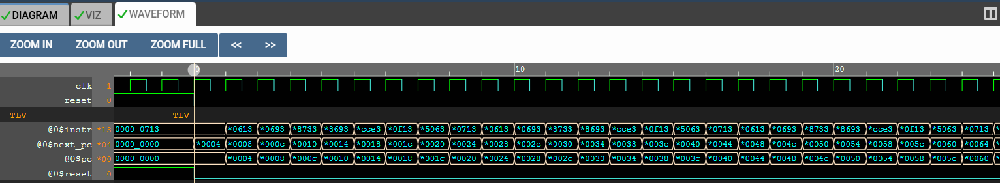
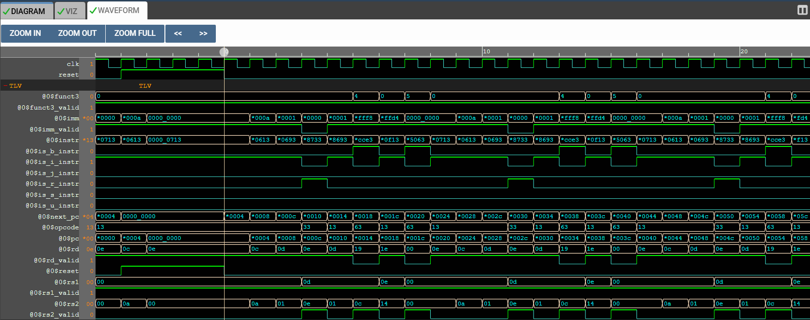
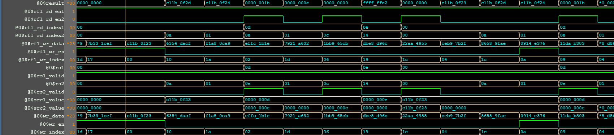
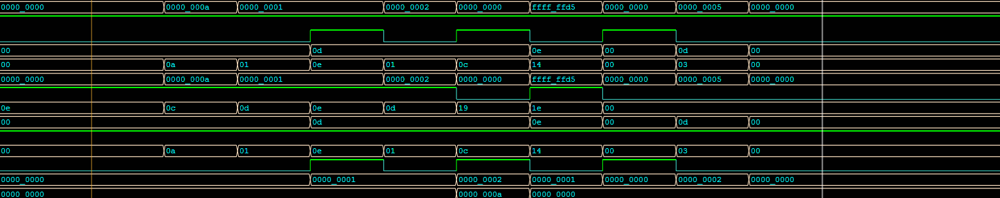
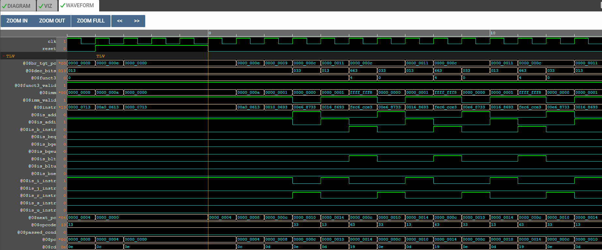
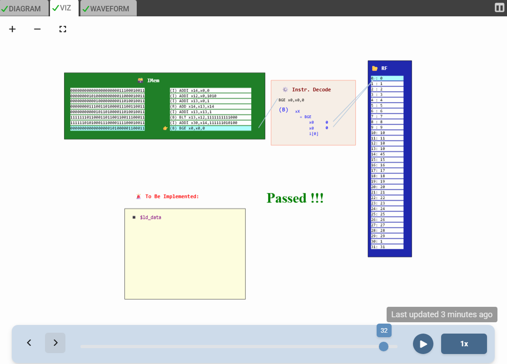

# 32-Bit RISC-V CPU Core - Phase 1: Core Architecture 🏗️

This directory contains the source code and documentation for **Phase 1** of the RISC-V processor development. In this phase, we constructed the fundamental 5-stage pipeline from scratch using **TL-Verilog** and verified it using a custom assembly program.

---

## 🎯 Phase 1 Goal: The "Sum 1 to 9" Challenge

The objective of this phase was to build a processor capability of executing a specific logic loop: **Calculate the sum of integers from 1 to 9.**

To achieve this, the core implements the following logic stages:
1.  **PC Logic:** Program Counter with Reset and Branch capabilities.
2.  **Fetch:** Retrieving 32-bit instructions from Memory.
3.  **Decode:** Parsing `ADD`, `ADDI`, `BLT`, `BGE`, etc.
4.  **Execute:** Arithmetic Logic Unit (ALU) for addition and comparison.
5.  **Write-Back:** Saving results to the Register File.
6.  **Control Flow:** Conditional Branching logic.

**Current Status:** ✅ **COMPLETED & VERIFIED**

---

## 🧩 Architecture Breakdown & Verification Proofs

Below is the step-by-step verification of the core logic, demonstrated using waveform simulations.

### 1. Instruction Fetch
The processor successfully generates addresses via the Program Counter (PC) and fetches the corresponding machine code from Instruction Memory.

*Figure 1: Instructions changing dynamically as PC increments.*

### 2. Instruction Decode
The raw instruction bits are parsed to extract Opcode, Source Registers (`rs1`, `rs2`), Destination Register (`rd`), and Immediate values.

*Figure 2: Valid signals asserting when instruction fields are decoded.*

### 3. Register Read & ALU Execution
The core reads values from the Register File and passes them to the ALU. The ALU correctly computes the sum.
* **Test Case:** Adding `13` (src1) and `14` (src2).
* **Result:** The ALU output (`$result`) is `27`.

*Figure 3: Verification of the ADD instruction logic.*

### 4. Register Write-Back
The calculated results are permanently stored back into the Register File.
* **Verification:** The value `1` is written into register `x13` (0d), confirming the `ADDI` operation.

*Figure 4: Synchronous write-back to the destination register.*

### 5. Branch Logic & Loop Execution
The processor correctly evaluates the branch condition (`BLT` - Branch Less Than). It loops back to the start until the counter reaches 10.

*Figure 5: PC updating to the Branch Target Address.*

---

## 🏆 Final Verification

The core was tested against an automated testbench asserting the final calculation result.
* **Expected Result:** Sum of 1..9 = 45.
* **Outcome:** The simulation verified the result and displayed "Passed".

*Figure 6: Makerchip Visualization confirming successful execution.*

---

## 📂 File Structure (Phase 1)

* **`riscv_core.tlv`**: The source code implementing the summation logic.
* **`assets/`**: Waveforms and images documenting the verification process.
* **`lib/`**: RISC-V shell libraries.

---

*This concludes Phase 1. For the full ISA compliance test suite, please refer to the Phase 2 directory.*