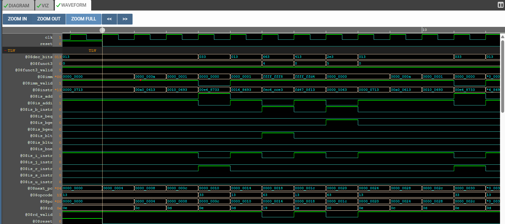

# 32-Bit RISC-V CPU Core Development 🚀

This repository documents the step-by-step construction of a 32-bit RISC-V processor core. The project is designed using **TL-Verilog** on the Makerchip platform and aims to build a fully functional processor compliant with the **RV32I Base Integer Instruction Set**.

The development process follows a "build-from-scratch" approach, starting from an empty shell and progressively adding logic stages such as Instruction Fetch, Decode, ALU, and Pipelining.

---

## 🛠️ Current Status: Stage 5 (ALU & Execute)

We have successfully implemented the **Arithmetic Logic Unit (ALU)**. The processor can now perform arithmetic operations (specifically ADD and ADDI) on data retrieved from the Register File and calculate valid results.

| Stage | Status | Description |
| :--- | :---: | :--- |
| **1. Project Shell & PC Logic** | ✅ | **Project structure setup and basic Program Counter implementation.** |
| **2. Instruction Fetch** | ✅ | **Connecting PC to IMem and fetching instructions.** |
| **3. Decode Logic** | ✅ | **Instruction Type Parsing & Field Extraction.** |
| **4. Register File Read** | ✅ | **Reading data from Source Registers (rs1, rs2).** |
| **5. ALU Operations** | ✅ | **Arithmetic computations (ADD, ADDI) & Result generation.** |
| **6. Register File Write** | ⏳ | Writing results back to memory. |
| **7. Pipelining** | ⏳ | Parallel execution stages for performance. |

---

## 🧩 Implemented Logic Description

### 1. Instruction Fetch & Decode
The processor fetches 32-bit instructions from memory and decodes them to identify:
* **Instruction Type:** Categorizes instructions into formats like R-Type, I-Type, S-Type, etc.
* **Fields:** Extracts critical data such as Opcode, Source Registers, Destination Register, and Immediate values.
* **Control Signals:** Identifies specific operations (e.g., ADDI, ADD, Branches) to direct the processor's actions.

### 2. Register File (Read Port)
The Register File acts as the processor's internal storage.
* **Functionality:** Using the decoded source register indices, the processor retrieves the stored values.
* **Optimization:** Read operations are only performed when the instruction type requires them (e.g., valid source registers).

### 3. Arithmetic Logic Unit (ALU)
The ALU is the computation engine of the core. It processes inputs based on the instruction type:
* **ADDI Operation:** Adds a value from a source register to an immediate constant.
* **ADD Operation:** Adds values from two source registers.
* **Result Generation:** The computed value is output as a result signal, ready to be used in subsequent stages or written back to memory.

---

## 📸 Simulation & Verification

The functionality of the core is verified using waveform simulations.

### Decode & Control Verification
The waveform below shows the active control signals and extracted immediate values. It confirms that the decoder correctly identifies the instruction type and prepares the necessary data for the ALU.

### ALU Calculation Verification
The waveform below provides proof of correct arithmetic execution.
* **Observation:** The signals representing source register values provide inputs to the ALU. The result signal updates instantly with the sum.
* **Example Case:** As seen in the trace, when the input values are `13` and `14`, the result correctly becomes `27`. This confirms the addition logic is functioning correctly.

---

## 📂 Project Structure

* **Core Source File:** The main TL-Verilog file containing the active processor logic.
* **Shell Source File:** The template file acting as the project skeleton.
* **Libraries:** External references for RISC-V macro definitions and assembler tools.

---

## 🚀 Development Tools

* **Language:** [TL-Verilog](https://www.redwoodeda.com/tl-verilog) (Transaction-Level Verilog)
* **IDE & Simulation:** [Makerchip](https://makerchip.com/)
* **Architecture:** [RISC-V](https://riscv.org/)