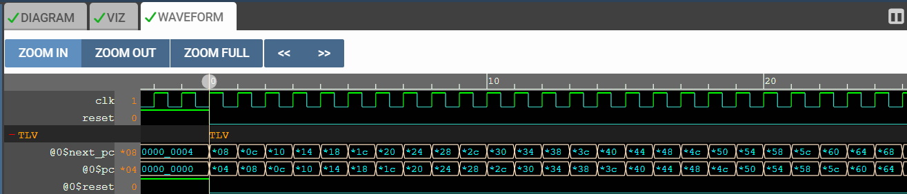
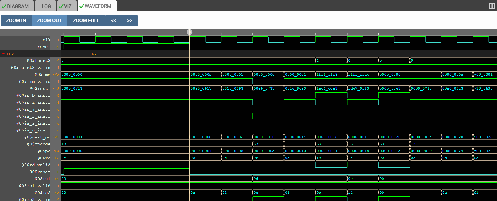

# RISC-V CPU Core (Work in Progress 🚧)

This is the main directory for the 32-bit RISC-V processor implementation. The goal is to build a fully pipelined CPU compliant with the RV32I instruction set.

### 🛠️ Current Status
- [x] **Testbench Setup:** Sums numbers 1 to 9 using Assembly.
- [x] **Instruction Fetch (IF):** PC logic and Instruction Memory (IMem) implemented.
- [x] **Instruction Decode (ID):** Opcode decoding and Instruction Type identification working.
- [x] **Field Decoding:** Registers (rs1, rs2, rd) and Immediate ($imm) values are correctly extracted.
- [ ] **ALU Implementation:** (Next Step)
- [ ] **Register File Interface:**
- [ ] **Pipelining Logic:**

---

## 🚀 Development Journey (Simulation Results)

Here is the step-by-step progress of the CPU design, validated through Makerchip simulations.

### Step 1: Program Counter (PC) Logic
The first step was to establish the "heartbeat" of the CPU. The Program Counter (`$pc`) increments by 4 bytes every cycle (`0`, `4`, `8`, `C`, `10`...) to fetch instructions sequentially from memory.

### Step 2: Instruction Decode Logic
Once the instruction is fetched, the CPU needs to understand "What is this?". Based on the **Opcode** (last 7 bits), flags like `$is_i_instr` (Immediate) or `$is_r_instr` (Register) are asserted.

### Step 3: Field Extraction & Immediate Generation (Latest 🆕)
After knowing the type, we dissect the 32-bit instruction to find the operands.
- **$imm:** Reconstructs constants (e.g., `0...0a` for 10) correctly for different instruction types.
- **$rs1/$rs2/$rd:** Extracts source and destination register addresses.
- **Valid Flags:** Logic gates (`$rs1_valid`, etc.) determine which fields are relevant for the current instruction.

<<<<<<< HEAD

---
=======
>>>>>>> e69d9f114769350af6cbef4538387f0b27e09eb5

---

---
**Acknowledgement:** This project is based on the "Building a RISC-V CPU Core" course by Steve Hoover.
