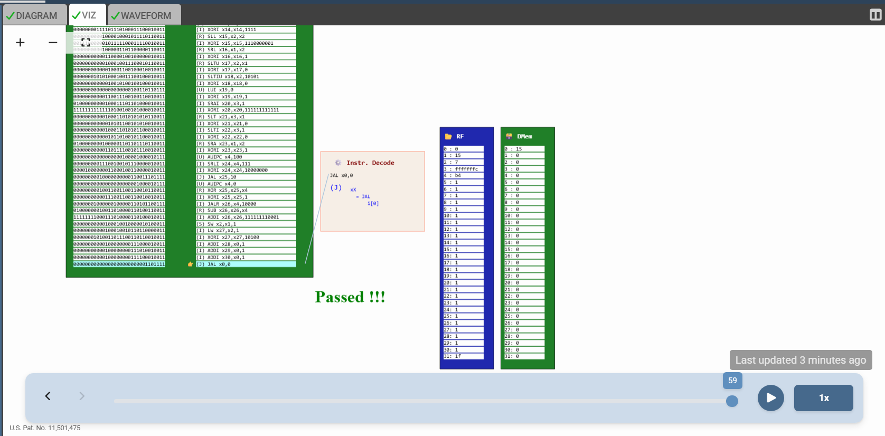
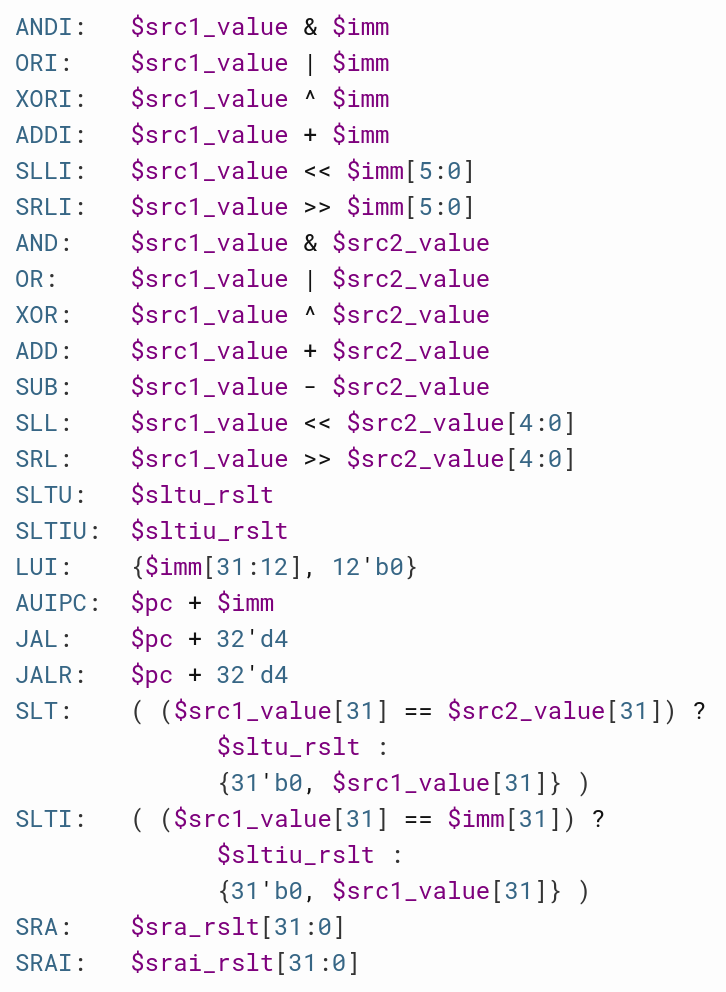

# 32-Bit RISC-V CPU Core - Final Phase: Memory & Complete ISA 🏆

This directory contains the source code and documentation for the **Final Phase** of the RISC-V processor development. In this milestone, we integrated **Data Memory (DMem)** support, effectively transforming the core into a fully functional, Turing-complete RISC-V processor compliant with the **RV32I** standard.

---

## 🎯 Final Goal: The "Load/Store" Challenge

The objective of this final phase was to implement memory access instructions (`LW` and `SW`) and pass the complete **RISC-V Test Suite**.

To achieve this, the architecture was finalized with:
1.  **Data Memory (DMem):** A 32-bit word-addressable memory for data storage.
2.  **Load Logic (`LW`):** Reading data from DMem and writing it back to the Register File.
3.  **Store Logic (`SW`):** Writing data from Source Register 2 (`rs2`) into DMem.
4.  **Write-Back Mux:** Selecting between ALU results and Memory data for the destination register.

**Current Status:** 🚀 **FULLY VERIFIED & PASSED**

---

## 🧩 Architecture Breakdown & Verification Proofs

Below is the step-by-step verification of the final core logic, demonstrating the successful execution of Arithmetic, Control Flow, and Memory operations.

### 1. Final Verification: "Passed !!!"
The core successfully executed the entire test suite.
* **Observation:** The visualizer displays the green **"Passed !!!"** message.
* **Data Memory:** The "DMem" column is visible and populated, confirming that `SW` instructions successfully wrote data to memory.
* **Registers:** Registers `x1` through `x30` contain the validation value `1`.

*Figure 1: The "Passed" state showing active Data Memory and Register File.*

### 2. Instruction Processing
The processor fetches complex instructions from the official test suite. The image below shows the Instruction Memory (IMem) loaded with the program code, including the final Load/Store tests.

*Figure 2: The RISC-V Test Suite loaded into IMem.*

### 3. Logic & Design Reference
To handle the complexity of the full ISA (Logic, Shifts, Comparisons), the ALU and Decode logic were implemented following strict architectural formulas. This reference diagram served as the blueprint for our signal routing.

*Figure 3: Reference logic used for ALU and Branch implementation.*

---

## 🛠️ Technical Implementation Summary

| Stage | Feature | Implementation Details |
| :--- | :--- | :--- |
| **Decode** | Full Recognition | Identifies R, I, S, B, U, J type instructions. |
| **ALU** | Advanced Math | `ADD`, `SUB`, `AND/OR/XOR`, `SLT/SLTU`, `SLL/SRL/SRA`. |
| **Control** | Jumps & Branches | `BEQ/BNE/BLT...`, `JAL` (Func Call), `JALR` (Return). |
| **Memory** | Load / Store | `LW` (Load Word) and `SW` (Store Word) with alignment. |

---

## 📂 File Structure

* **`riscv_core.tlv`**: The final, fully functional source code of the processor.
* **`assets/`**: Verification images and logic references.
* **`lib/`**: RISC-V shell libraries.

---

*Project Completed. The RISC-V Core is now fully operational.*